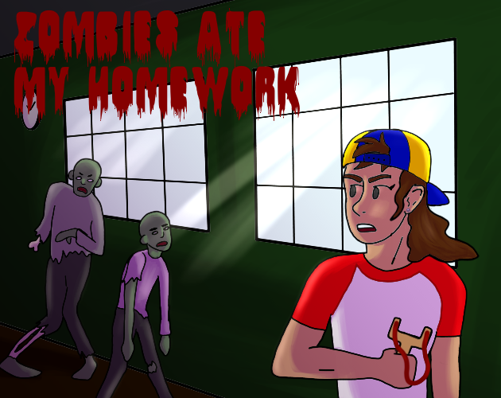

<!DOCTYPE HTML>
<html>
<head>
<title>104 Labs</title>
	<link rel="icon" href="images/140x1000.png">
<meta charset="utf-8">
<noscript>
<link rel="stylesheet" href="css/5grid/core.css">
<link rel="stylesheet" href="css/5grid/core-desktop.css">
<link rel="stylesheet" href="css/5grid/core-1200px.css">
<link rel="stylesheet" href="css/5grid/core-noscript.css">
<link rel="stylesheet" href="css/style.css">
<link rel="stylesheet" href="css/style-desktop.css">
</noscript>

<!--[if IE 9]><link rel="stylesheet" href="css/style-ie9.css"><![endif]-->
</head>
<body class="homepage">

    <header id="header" class="5grid-layout">
  

      

          <!-- Logo -->
        <h1><a href="#" class="mobileUI-site-name"> &nbsp; &nbsp; &nbsp; 104 Labs</a></h1>

        <h2> &nbsp; &nbsp; &nbsp; &nbsp; &nbsp; &nbsp; &nbsp; &nbsp; &nbsp; &nbsp; &nbsp; &nbsp; &nbsp; &nbsp; &nbsp; &nbsp; &nbsp; &nbsp; &nbsp; &nbsp; &nbsp; &nbsp; &nbsp; &nbsp; &nbsp; &nbsp; &nbsp; &nbsp; &nbsp; &nbsp; &nbsp; &nbsp; &nbsp; &nbsp; &nbsp; &nbsp; &nbsp; &nbsp; &nbsp; &nbsp; &nbsp; &nbsp; &nbsp; &nbsp; &nbsp; &nbsp; &nbsp; &nbsp; &nbsp; &nbsp; &nbsp; &nbsp; &nbsp; &nbsp; &nbsp; &nbsp; &nbsp; &nbsp; Good Games for a Good Cause</h2>

        

          <nav class="mobileUI-site-nav">
            <ul>
              <li class="current_page_item"><a href="index.html">Home</a></li>
              <li><a href="threecolumn.html">About</a></li>
              <li><a href="threecolumn.html">Contact</a></li>
              <li><a  href="https://twitter.com/104Labs" target= "_blank" >Social Media</a></li>
              <li><a href="threecolumn.html">Causes</a></li>
			
            </ul>
          </nav>
      

      

    </header>
    

      

        

          

        

      

    

  

  

    

      

        
 104 Labs is an indie game company full of passionate people making good games for a good cause. 

                              

    

  

    

      

 

        <h3>
You’re walking to school when, suddenly, a zombie appears and EATS your homework (and, well, most of your bag, too, but that’s not important). When you try to explain what happened, you’re met with detention instead. While sitting there, people start screaming outside and your teacher rushes out. Moments later, a horde of zombies pile in and all you have is a slingshot and a drawer full of LOST-AND-FOUND items to shoot at them. Good thing you’ve been practicing your aim.
 </h3>
        

          <section>

&nbsp;

          </section>
        

          <section><a href="https://webster-game-design.itch.io/zombies-ate-my-homework" target= "_blank" class="button">Play Now&nbsp;</a>
            
&nbsp;

&nbsp;

          </section>
        

      

  

  
 

  

	  
&copy; 104labs.com 

  

</body>
</html>
